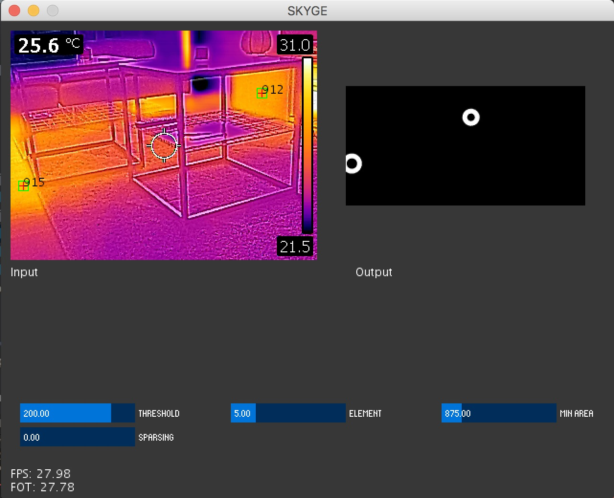

# SKYGE
SKYGE is an interactive art installation with light.

*Figure 1 Front*

The basic concept is to create an abstract cloud which accommodates including the movements of people in and thus creates a more level.

*Figure 2 Indoor*

The installation interacts with the visitors through a thermal view camera. This camera detects the position and approximate count of the people under SKYGE and then creates visual effects which are shown on the panels.

## Implementation

The implementation of the people tracking under the people is done with OpenCV and Processing.

*Figure 3 Software*

As shown on the image the software tries to find the **brightest areas** in the image. If the area is big enough to be relevant, the application shows a cross sign at the **center** of the area (see *Figure 3*).